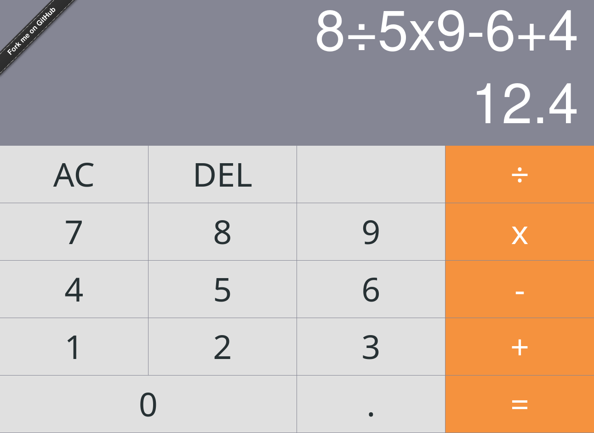

Calculator
---

Differences From The Original Project
---
- add another display to show the processing operation.
- add a button to delete the last digit.
- remove some less important buttons.

The current panel looks like this:

Created with *create-react-app*. See the [full create-react-app guide](https://github.com/facebookincubator/create-react-app/blob/master/packages/react-scripts/template/README.md).

Try It
---

[ahfarmer.github.io/calculator](https://ahfarmer.github.io/calculator/)

Install
---

`npm install`

Usage
---

`npm start`
